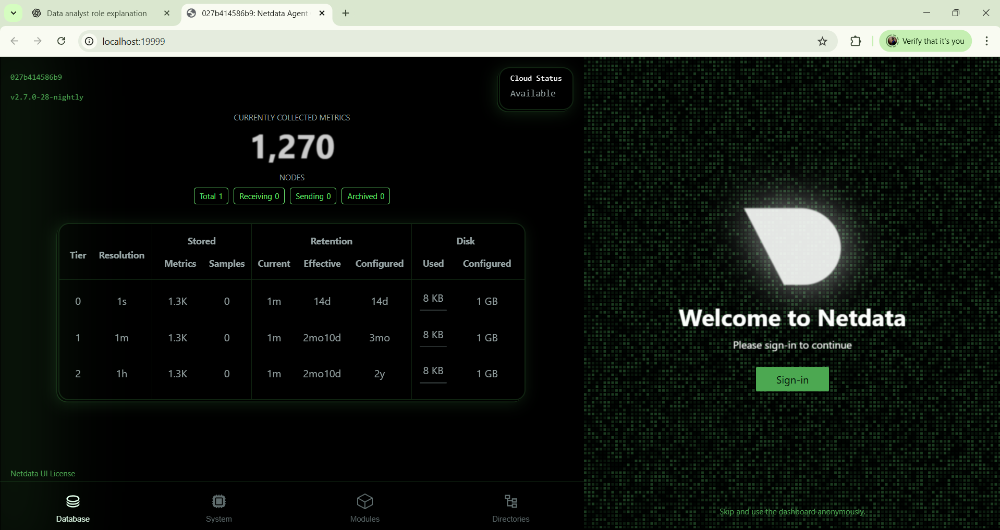

# 📊 Task 7: Monitor System Resources Using Netdata  

## 🎯 Objective  
The objective of this task is to **install Netdata** using Docker and visualize **system and application performance metrics** in real-time. By completing this task, we understand how lightweight monitoring works for servers and applications.  

---

## 🛠 Tools Used  
- **Netdata** → Open-source, real-time monitoring tool  
- **Docker** → To containerize and run Netdata  
- **Browser (Chrome/Firefox)** → To access the monitoring dashboard  

---
## Screenshots
 

## Screenshots
 

 ## Screenshots
 
## 🚀 Steps Performed  

### **1. Run Netdata with Docker**  
Pulled and started Netdata container:  

```bash
docker run -d --name=netdata \
  -p 19999:19999 \
  --cap-add SYS_PTRACE \
  --security-opt apparmor=unconfined \
  netdata/netdata
  

✅ Explanation:

-d → Detached mode

-p 19999:19999 → Maps port 19999 on host to container (Netdata runs on port 19999)

--cap-add SYS_PTRACE & --security-opt apparmor=unconfined → Required for process monitoring

2. Verify Container

Checked if Netdata was running:
docker ps
Output shows container netdata running.

3. Access Dashboard
Opened the browser at:
👉 http://localhost:19999

This displayed the Netdata dashboard with real-time monitoring metrics.

4. Key Metrics Monitored
CPU Usage (per-core utilization, load averages)

Memory Usage (RAM + Swap usage)

Disk I/O (reads/writes, disk pressure)

Network Traffic (inbound/outbound packets)

Docker Container Stats (if multiple containers are running)

5. Logs Exploration
To explore logs inside container:

bash
Copy code
docker exec -it netdata /bin/bash
cd /var/log/netdata
ls
Here we can view logs like error.log, access.log.

6. Alerts & Alarms
Netdata has built-in alerts for CPU, RAM, Disk, Network.

Alerts are visible as colored badges (green = healthy, yellow/red = warning/critical).

Alerts can be configured to send notifications (email, Slack, Discord, etc.).

📸 Screenshot
Here is the Netdata dashboard running on my system:


🔍 Key Learnings
Netdata provides lightweight, real-time monitoring.

Easy to deploy with a single Docker command.

Provides rich dashboards without extra configuration.

Supports alerts and per-container monitoring.

Complements tools like Prometheus for long-term data storage.

❓ Interview Questions
What does Netdata monitor?

CPU, memory, disk, network, applications, and Docker containers in real-time.

How do you view real-time metrics?

By accessing the Netdata dashboard at http://localhost:19999 or via Netdata Cloud.

What is a collector?

A module that gathers metrics from a source (e.g., CPU, MySQL, Docker).

How is Netdata different from Prometheus?

Netdata → Real-time, lightweight, built-in dashboard.

Prometheus → Time-series database for historical monitoring & integrations.

What are some performance KPIs to watch?

CPU load, memory usage, disk I/O, network throughput, container health.

How to deploy Netdata on a VM?

Either run via Docker or install using the script:

bash
Copy code
bash <(curl -Ss https://my-netdata.io/kickstart.sh)
How does Netdata alerting work?

Uses built-in thresholds and sends notifications (email, Slack, etc.).

What is a dashboard in this context?

A web-based UI showing charts and real-time metrics of system resources.

✅ Outcome
Successfully deployed Netdata via Docker, explored real-time system metrics, checked logs, and understood lightweight server monitoring.

Task-7-Netdata-Monitoring/
│── README.md
│── screenshots/
│    └── netdata_dashboard.png


